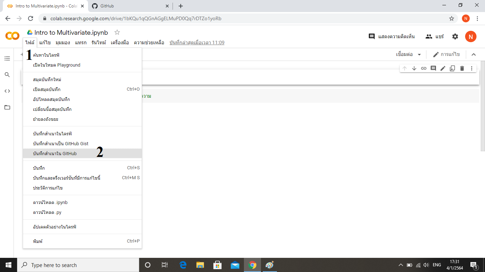
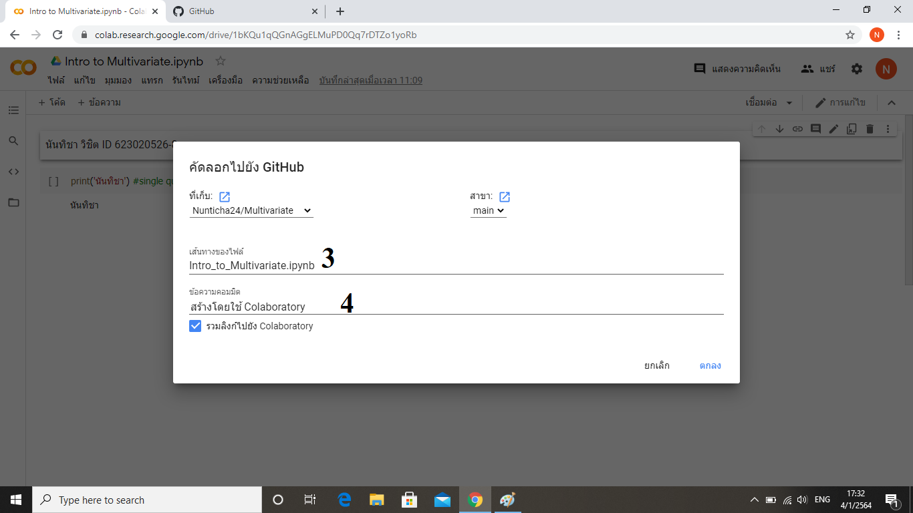

# Multivariate

### นันทิชา ID 623020526-8

.md => Markdown

อธิบายการใช้งาน Github และ Google Colab ว่าหน้าที่ของแต่ละอันคืออะไร และอธิบายวิธีเซฟไฟล์จาก Google Colab ลงใน Github

## Github
คือ แหล่งรวมโค้ดไฟล์ที่สามารถแชร์ให้คนอื่นเข้ามาแก้ไขโค้ดหรือดูโค้ดได้

## Google Colab 
คือ อินเตอร์เฟดในการเขียนโค้ด

## การเซฟไฟล์จาก Google Colab ลงใน Github 
**1.คลิก ไฟล์  
2.คลิก บักทึกสำเนาใน github** 

**3.ตั้งชื่อไฟล์  
4.ใส่ comment แล้วกดตกลง**

